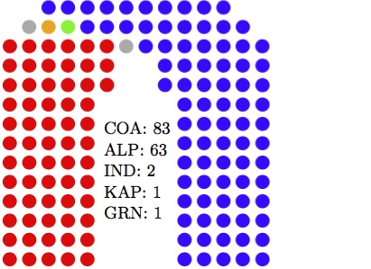

# Current seat-by-seat forecast (Mackerras pendulum)

| ALP                          | COA                          |
|------------------------------|------------------------------|
|*Banks*: NSW (50.04)          |*Reid*: NSW (50.05)           |
|*Dobell*: NSW (50.06)         |*Melbourne Ports*: VIC (50.44)|
|*Lyons*: TAS (50.18)          |*Page*: NSW (50.47)           |
|*Eden-Monaro*: NSW (50.22)    |*Hindmarsh*: SA (50.5)        |
|*Capricornia*: QLD (51.05)    |*Lindsay*: NSW (51.1)         |
|*Chisholm*: VIC (51.2)        |*Robertson*: NSW (51.12)      |
|*Moreton*: QLD (51.58)        |*Bendigo*: VIC (51.14)        |
|*Parramatta*: NSW (51.91)     |*Braddon*: TAS (51.31)        |
|*Solomon*: NT (52.06)         |*Gilmore*: NSW (51.49)        |
|*Petrie*: QLD (52.15)         |*Forde*: QLD (52.49)          |
|*Griffith*: QLD (52.35)       |*Bonner*: QLD (52.88)         |
|*McEwen*: VIC (52.5)          |*Hasluck*: WA (53.35)         |
|*Jagajaga*: VIC (52.5)        |*Bass*: TAS (53.35)           |
|*Lilley*: QLD (52.8)          |*Deakin*: VIC (53.99)         |
|*Barton*: NSW (52.86)         |*La Trobe*: VIC (54.02)       |
|*Bruce*: VIC (53.23)          |*Leichhardt*: QLD (54.4)      |
|*Kingsford Smith*: NSW (53.24)|*Flynn*: QLD (55.01)          |
|*Adelaide*: SA (54.23)        |*Macquarie*: NSW (55.57)      |
|*Richmond*: NSW (54.26)       |*Cowan*: WA (55.75)           |
|*Lingiari*: NT (54.44)        |*Longman*: QLD (56.03)        |
|*Isaacs*: VIC (54.55)         |*Herbert*: QLD (56.16)        |
|*Brand*: WA (55.0)            |*Boothby*: SA (56.18)         |
|*Perth*: WA (55.38)           |*Corangamite*: VIC (56.2)     |
|*Oxley*: QLD (55.67)          |*Brisbane*: QLD (56.24)       |
|*Franklin*: TAS (55.73)       |*Swan*: WA (56.38)            |
|*Fremantle*: WA (55.75)       |*Dunkley*: VIC (56.54)        |
|*Greenway*: NSW (55.81)       |*Dickson*: QLD (56.73)        |
|*Werriwa*: NSW (56.02)        |*Aston*: VIC (57.14)          |
|*Rankin*: QLD (56.3)          |*Dawson*: QLD (57.24)         |
|*Ballarat*: VIC (56.4)        |*Bennelong*: NSW (57.8)       |
|*Wakefield*: SA (56.53)       |*Bowman*: QLD (58.25)         |
|*Canberra*: ACT (56.87)       |*Casey*: VIC (58.38)          |
|*Blair*: QLD (57.45)          |*Hinkler*: QLD (58.42)        |
|*Throsby*: NSW (57.5)         |*Hughes*: NSW (59.08)         |
|*McMahon*: NSW (58.25)        |*Stirling*: WA (59.3)         |
|*Makin*: SA (58.89)           |*Macarthur*: NSW (59.88)      |
|*Corio*: VIC (58.97)          |*Sturt*: SA (59.89)           |
|*Watson*: NSW (59.32)         |*Paterson*: NSW (60.11)       |
|*Hunter*: NSW (59.8)          |*Wannon*: VIC (60.12)         |
|*Newcastle*: NSW (59.81)      |*Cowper*: NSW (61.02)         |
|*Shortland*: NSW (59.86)      |*Ryan*: QLD (61.09)           |
|*Hotham*: VIC (59.89)         |*Pearce*: WA (61.2)           |
|*Cunningham*: NSW (61.89)     |*Moore*: WA (61.41)           |
|*Fraser*: ACT (62.77)         |*Canning*: WA (61.8)          |
|*Maribyrnong*: VIC (62.84)    |*McMillan*: VIC (62.24)       |
|*Holt*: VIC (62.96)           |*Higgins*: VIC (62.6)         |
|*Sydney*: NSW (64.07)         |*Grey*: SA (62.7)             |
|*Kingston*: SA (64.12)        |*Hume*: NSW (62.8)            |
|*Lalor*: VIC (64.38)          |*Fisher*: QLD (63.08)         |
|*Chifley*: NSW (64.76)        |*Goldstein*: VIC (63.81)      |
|*Charlton*: NSW (65.7)        |*Flinders*: VIC (63.87)       |
|*Blaxland*: NSW (65.8)        |*Mayo*: SA (63.94)            |
|*Scullin*: VIC (66.87)        |*McPherson*: QLD (63.95)      |
|*Calwell*: VIC (66.92)        |*Forrest*: WA (64.19)         |
|*Batman*: VIC (67.07)         |*Tangney*: WA (64.4)          |
|*Gellibrand*: VIC (67.82)     |*Wright*: QLD (64.42)         |
|*Port Adelaide*: SA (69.65)   |*Kooyong*: VIC (64.73)        |
|*Gorton*: VIC (69.93)         |*Menzies*: VIC (64.91)        |
|*Grayndler*: NSW (70.29)      |*Wide Bay*: QLD (65.21)       |
|*Fowler*: NSW (71.89)         |*Calare*: NSW (65.43)         |
|*Wills*: VIC (71.96)          |*Gippsland*: VIC (65.88)      |
|                              |*Lyne*: NSW (66.01)           |
|                              |*Cook*: NSW (66.58)           |
|                              |*Fadden*: QLD (66.59)         |
|                              |*Farrer*: NSW (66.83)         |
|                              |*Groom*: QLD (67.61)          |
|                              |*Moncrieff*: QLD (68.26)      |
|                              |*North Sydney*: NSW (68.78)   |
|                              |*Warringah*: NSW (69.53)      |
|                              |*Barker*: SA (69.91)          |
|                              |*Riverina*: NSW (70.29)       |
|                              |*Wentworth*: NSW (70.37)      |
|                              |*Berowra*: NSW (70.66)        |
|                              |*Curtin*: WA (70.76)          |
|                              |*Durack*: WA (70.78)          |
|                              |*Parkes*: NSW (71.06)         |
|                              |*Murray*: VIC (71.13)         |
|                              |*Mackellar*: NSW (71.3)       |
|                              |*Mitchell*: NSW (71.81)       |
|                              |*Bradfield*: NSW (73.44)      |
|                              |*Maranoa*: QLD (73.57)        |
|                              |*O'Connor*: WA (74.69)        |
|                              |*Indi*: VIC (75.34)           |
|                              |*Mallee*: VIC (75.88)         |
|                              |*New England*: NSW (76.8)     |
