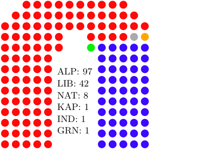

# Current seat-by-seat forecast (Mackerras pendulum)

Forecast last updated on 5/2/2019 at 4:01 AEST 

| ALP                          | COA                          |
|------------------------------|------------------------------|
|*Solomon*: NT (50.13)         |*Mayo*: SA (50.05)            |
|*Tangney*: WA (50.14)         |*Durack*: WA (50.13)          |
|*Bowman*: QLD (50.53)         |*Brisbane*: QLD (50.28)       |
|*Stirling*: WA (50.65)        |*Deakin*: VIC (50.34)         |
|*Fairfax*: QLD (51.33)        |*McMillan*: VIC (50.45)       |
|*Page*: NSW (51.63)           |*Grey*: SA (50.7)             |
|*Corangamite*: VIC (51.7)     |*Aston*: VIC (50.71)          |
|*Reid*: NSW (51.84)           |*Fisher*: QLD (50.78)         |
|*Swan*: WA (51.98)            |*Casey*: VIC (51.15)          |
|*Pearce*: WA (52.56)          |*Canning*: WA (51.33)         |
|*La Trobe*: VIC (53.46)       |*Cowper*: NSW (51.46)         |
|*Sturt*: SA (53.86)           |*McPherson*: QLD (52.17)      |
|*Hasluck*: WA (53.94)         |*Bennelong*: NSW (52.45)      |
|*Dunkley*: VIC (53.94)        |*Ryan*: QLD (53.02)           |
|*Bonner*: QLD (54.04)         |*O'Connor*: WA (53.04)        |
|*Dawson*: QLD (54.19)         |*Hughes*: NSW (53.26)         |
|*Chisholm*: VIC (54.85)       |*Flinders*: VIC (53.26)       |
|*Wide Bay*: QLD (54.97)       |*Forrest*: WA (53.56)         |
|*Gilmore*: NSW (55.02)        |*Murray*: VIC (53.67)         |
|*Robertson*: NSW (55.1)       |*North Sydney*: NSW (53.87)   |
|*Macnamara*: VIC (55.25)      |*Groom*: QLD (54.1)           |
|*Richmond*: NSW (55.36)       |*Wannon*: VIC (54.22)         |
|*Banks*: NSW (55.6)           |*Hume*: NSW (54.5)            |
|*Dickson*: QLD (55.76)        |*Moore*: WA (54.53)           |
|*Cooper*: VIC (55.93)         |*Menzies*: VIC (55.07)        |
|*Lyons*: TAS (56.02)          |*Barker*: SA (55.21)          |
|*Cowan*: WA (56.8)            |*Calare*: NSW (55.3)          |
|*Leichhardt*: QLD (57.12)     |*Lyne*: NSW (55.44)           |
|*Hinkler*: QLD (57.28)        |*Higgins*: VIC (55.73)        |
|*Eden-Monaro*: NSW (57.35)    |*Maranoa*: QLD (56.13)        |
|*Braddon*: TAS (57.51)        |*Goldstein*: VIC (56.95)      |
|*Wright*: QLD (57.92)         |*Moncrieff*: QLD (57.34)      |
|*Perth*: WA (57.93)           |*Kooyong*: VIC (57.39)        |
|*Lindsay*: NSW (58.23)        |*Mackellar*: NSW (57.9)       |
|*Macquarie*: NSW (58.39)      |*Cook*: NSW (58.2)            |
|*Bean*: ACT (58.42)           |*Indi*: VIC (58.43)           |
|*Capricornia*: QLD (58.64)    |*Berowra*: NSW (59.12)        |
|*Hindmarsh*: SA (59.07)       |*Parkes*: NSW (59.54)         |
|*Bass*: TAS (59.14)           |*Mitchell*: NSW (61.1)        |
|*Forde*: QLD (59.36)          |*Riverina*: NSW (61.24)       |
|*Jagajaga*: VIC (59.63)       |*Fowler*: NSW (61.33)         |
|*Isaacs*: VIC (60.11)         |*Farrer*: NSW (61.46)         |
|*Bendigo*: VIC (60.23)        |*Boothby*: SA (61.67)         |
|*Bruce*: VIC (60.32)          |*Bradfield*: NSW (62.36)      |
|*Longman*: QLD (60.42)        |*Wentworth*: NSW (63.06)      |
|*Moreton*: QLD (60.76)        |*Gippsland*: VIC (63.45)      |
|*Wills*: VIC (60.86)          |*Curtin*: WA (64.98)          |
|*Lingiari*: NT (61.22)        |*Warringah*: NSW (65.48)      |
|*Herbert*: QLD (61.68)        |*Mallee*: VIC (66.86)         |
|*Flynn*: QLD (62.02)          |*New England*: NSW (72.24)    |
|*Lilley*: QLD (62.04)         |                              |
|*Petrie*: QLD (62.04)         |                              |
|*Canberra*: ACT (62.34)       |                              |
|*Adelaide*: SA (62.69)        |                              |
|*Fremantle*: WA (62.8)        |                              |
|*Hotham*: VIC (62.83)         |                              |
|*Kingsford-Smith*: NSW (63.14)|                              |
|*Burt*: WA (63.17)            |                              |
|*Corio*: VIC (63.91)          |                              |
|*Ballarat*: VIC (63.92)       |                              |
|*Werriwa*: NSW (63.95)        |                              |
|*Dobell*: NSW (64.25)         |                              |
|*Grayndler*: NSW (64.3)       |                              |
|*Parramatta*: NSW (64.4)      |                              |
|*Greenway*: NSW (64.4)        |                              |
|*Barton*: NSW (64.73)         |                              |
|*McEwen*: VIC (64.79)         |                              |
|*Macarthur*: NSW (65.0)       |                              |
|*Franklin*: TAS (65.12)       |                              |
|*Gellibrand*: VIC (65.14)     |                              |
|*Griffith*: QLD (65.57)       |                              |
|*Shortland*: NSW (65.89)      |                              |
|*Port Adelaide*: SA (66.55)   |                              |
|*Brand*: WA (66.62)           |                              |
|*Hunter*: NSW (67.28)         |                              |
|*Scullin*: VIC (67.8)         |                              |
|*Maribyrnong*: VIC (68.36)    |                              |
|*Lalor*: VIC (68.48)          |                              |
|*Fenner*: ACT (68.52)         |                              |
|*Sydney*: NSW (68.52)         |                              |
|*McMahon*: NSW (68.87)        |                              |
|*Newcastle*: NSW (69.0)       |                              |
|*Cunningham*: NSW (69.15)     |                              |
|*Rankin*: QLD (69.27)         |                              |
|*Paterson*: NSW (69.54)       |                              |
|*Oxley*: QLD (69.82)          |                              |
|*Holt*: VIC (70.79)           |                              |
|*Blair*: QLD (70.81)          |                              |
|*Whitlam*: NSW (70.83)        |                              |
|*Makin*: SA (70.9)            |                              |
|*Watson*: NSW (72.05)         |                              |
|*Wakefield*: SA (72.84)       |                              |
|*Calwell*: VIC (73.5)         |                              |
|*Gorton*: VIC (75.47)         |                              |
|*Blaxland*: NSW (75.65)       |                              |
|*Chifley*: NSW (76.51)        |                              |
|*Kingston*: SA (77.28)        |                              |
